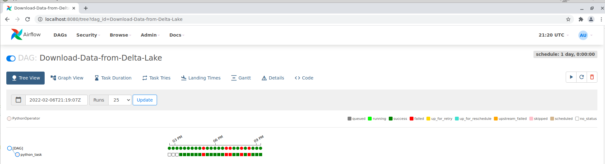
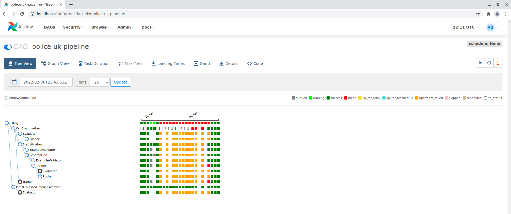

# Aws-mwaa-local-runner

Due to cost reasons we used this docker container. This repository provides a command line interface (CLI) utility that replicates an Amazon Managed Workflows for Apache Airflow (MWAA) environment locally.

You can find the repo at the following link: ([GitHub - aws/aws-mwaa-local-runner: This repository provides a command line interface (CLI) utility that replicates an Amazon Managed Workflows for Apache Airflow (MWAA) environment locally.](https://github.com/aws/aws-mwaa-local-runner))

## Get Started

Open the folder [aws-mwaa-local-runner](https://github.com/MLOPs-team/kirenz-mlops-semester/tree/main/aws-mwaa-local-runner "aws-mwaa-local-runner")

Activate your created conda environment:

```python
conda activate tfx
```

Build the docker image:

```python
./mwaa-local-env build-image
```

Start the docker container: 

```python
./mwaa-local-env start
```

Open the Apache Airflow UI:  http://localhost:8080/

Credentials:

- Username: admin

- Password: test

In Airflow you will now see the following 2 DAGS:

- Download-Data-from-Delta-Lake

- police-uk-pipeline

## How to run the pipeline?

1. Start the DAG Download-Data-from-Delta-Lake 
2. Start the DAG police-uk-pipeline 

### Start the DAG Download-Data-from-Delta-Lake

To run the model we need the data from Delta Lake. For this we have written the DAG Download-Data-from-Delta-Lake. In this DAG the gold data is downloaded from Delta Lake and provided in csv format for the model. Since the parquet files loaded from Delta Lake are too large for our model the data set is reduced to 100,000 randomly selected rows. 

```python
"THIS IS A DAG TO DOWNLOAD THE DATA FROM THE DELTA LAKE"
from datetime import timedelta

import airflow
from airflow import DAG
from airflow.operators.python_operator import PythonOperator

import pyspark
from pyspark.sql import SparkSession
from delta import *
import pandas as pd

default_args = {
    'owner': 'airflow',    
    'start_date': airflow.utils.dates.days_ago(2),
    # 'end_date': datetime(2018, 12, 30),
    'depends_on_past': False,
    'email_on_failure': False,
    'email_on_retry': False,
    }

def my_func():
    builder = pyspark.sql.SparkSession.builder.appName("MyApp") \
        .config("spark.sql.extensions", "io.delta.sql.DeltaSparkSessionExtension") \
        .config("spark.sql.catalog.spark_catalog", "org.apache.spark.sql.delta.catalog.DeltaCatalog")

    spark = configure_spark_with_delta_pip(builder).getOrCreate()

    df = spark.read.format("delta").load("/mnt/s3/dataForcesGold")
    pandas_df = df.toPandas()
    pandas_df = pandas_df.sample(n=10000)
    pandas_df.to_csv("/usr/local/airflow/data/data.csv")

with DAG('Download-Data-from-Delta-Lake', default_args=default_args) as dag:
    python_task    = PythonOperator(
        task_id='python_task',
        python_callable=my_func
        )
```

After starting the pipeline, the progress can be tracked in Airflow. In the Tree view all components can be seen, which are passed through in this DAG.



The data has now been downloaded to the docker container and the model can be started

### Start the DAG police-uk-pipeline

In this DAG the tfx pipeline is executed. The previously provided data is read into the pipeline. In a DNN Keras model police data are classified. At the end of the pipeline the trained model is evaluated. 

```python
# Copyright 2019 Google LLC. All Rights Reserved.
#
# Licensed under the Apache License, Version 2.0 (the "License");
# you may not use this file except in compliance with the License.
# You may obtain a copy of the License at
#
#     http://www.apache.org/licenses/LICENSE-2.0
#
# Unless required by applicable law or agreed to in writing, software
# distributed under the License is distributed on an "AS IS" BASIS,
# WITHOUT WARRANTIES OR CONDITIONS OF ANY KIND, either express or implied.
# See the License for the specific language governing permissions and
# limitations under the License.

import datetime
from typing import List
from fileinput import filename
import logging
import boto3
from botocore.exceptions import ClientError
import os
from dotenv import load_dotenv
import tensorflow as tf

import tensorflow_model_analysis as tfma
from tfx.components import CsvExampleGen
from tfx.components import FileBasedExampleGen
from tfx.components.base.executor_spec import ExecutorClassSpec
from tfx.components.example_gen.custom_executors import parquet_executor
from tfx.components import Evaluator
from tfx.components import ExampleValidator
from tfx.components import Pusher
from tfx.components import SchemaGen
from tfx.components import StatisticsGen
from tfx.components import Trainer
from tfx.dsl.components.common import resolver
from tfx.dsl.experimental import latest_blessed_model_resolver
from tfx.orchestration import data_types
from tfx.orchestration import metadata
from tfx.orchestration import pipeline
from tfx.orchestration.airflow.airflow_dag_runner import AirflowDagRunner
from tfx.orchestration.airflow.airflow_dag_runner import AirflowPipelineConfig
from tfx.proto import pusher_pb2
from tfx.proto import trainer_pb2
from tfx.types import Channel
from tfx.types.standard_artifacts import Model
from tfx.types.standard_artifacts import ModelBlessing
from google.protobuf.wrappers_pb2 import BoolValue

load_dotenv()

os.environ['TF_FORCE_GPU_ALLOW_GROWTH'] = 'true'

# TODO(jyzhao): rename to chicago_taxi_airflow.
_pipeline_name = 'police-uk-pipeline'

# This example assumes that the taxi data is stored in ~/taxi/data and the
# taxi utility function is in ~/taxi.  Feel free to customize this as needed.
_data_root = "/usr/local/airflow/data/"
# Python module file to inject customized logic into the TFX components. The
# Transform and Trainer both require user-defined functions to run successfully.
_module_file = '/usr/local/airflow/dags/police-uk_utils.py'
# Path which can be listened to by the model server.  Pusher will output the
# trained model here.
_serving_model_dir = "/usr/local/airflow/police-uk-pipeline/pipeline/model"

# Directory and data locations.  This example assumes all of the chicago taxi
# example code and metadata library is relative to $HOME, but you can store
# these files anywhere on your local filesystem.
_pipeline_root = "/usr/local/airflow/police-uk-pipeline/pipeline/"
# Sqlite ML-metadata db path.
_metadata_path = "/usr/local/airflow/police-uk-pipeline/metadata/metadata.db"

# Pipeline arguments for Beam powered Components.
_beam_pipeline_args = [
    '--direct_running_mode=multi_processing',
    # 0 means auto-detect based on on the number of CPUs available
    # during execution time.
    '--direct_num_workers=0',
]

# Airflow-specific configs; these will be passed directly to airflow
_airflow_config = {
    'schedule_interval': None,
    'start_date': datetime.datetime(2019, 1, 1),
}


def _create_pipeline(
    pipeline_name: str, 
    pipeline_root: str, 
    data_root: str,
    module_file: str, 
    serving_model_dir: str,
    metadata_path: str,
    beam_pipeline_args: List[str]
    ) -> pipeline.Pipeline:
  """Implements the chicago taxi pipeline with TFX."""
  # Parametrize data root so it can be replaced on runtime. See the
  # "Passing Parameters when triggering dags" section of
  # https://airflow.apache.org/docs/apache-airflow/stable/dag-run.html
  # for more details.
  data_root_runtime = data_types.RuntimeParameter(
      'data_root', ptype=str, default=data_root)

  # Brings data into the pipeline or otherwise joins/converts training data
  example_gen = CsvExampleGen(input_base=data_root_runtime)

   #executor_spec = ExecutorClassSpec(parquet_executor.Executor)
   #example_gen = FileBasedExampleGen(input_base=data_root_runtime, custom_executor_spec=executor_spec)

  # Computes statistics over data for visualization and example validation.
  statistics_gen = StatisticsGen(examples=example_gen.outputs['examples'])

  # Generates schema based on statistics files.
  schema_gen = SchemaGen(
      statistics=statistics_gen.outputs['statistics'],
      infer_feature_shape=False)

  # Performs anomaly detection based on statistics and data schema.
  example_validator = ExampleValidator(
      statistics=statistics_gen.outputs['statistics'],
      schema=schema_gen.outputs['schema'])


  # Uses user-provided Python function that implements a model.
  trainer = Trainer(
      module_file=module_file,
      examples=example_gen.outputs['examples'],
      schema=schema_gen.outputs['schema'],
      train_args=trainer_pb2.TrainArgs(num_steps=1000),
      eval_args=trainer_pb2.EvalArgs(num_steps=20))


# Get the latest blessed model for model validation.
  model_resolver = resolver.Resolver(
      strategy_class=latest_blessed_model_resolver.LatestBlessedModelResolver,
      model=Channel(type=Model),
      model_blessing=Channel(
          type=ModelBlessing)).with_id('latest_blessed_model_resolver')


# Uses TFMA to compute a evaluation statistics over features of a model and
  # perform quality validation of a candidate model (compared to a baseline).
  metrics = [
            tfma.metrics.ConfusionMatrixPlot(name='confusion_matrix_plot'),
            tfma.metrics.BalancedAccuracy(name='bac'),
            tfma.metrics.MeanLabel(name='mean_label'),
            tfma.metrics.MeanPrediction(name='mean_prediction'),
            tfma.metrics.Calibration(name='calibration'),
            tfma.metrics.CalibrationPlot(name='calibration_plot'),
        ]
  eval_config = tfma.EvalConfig(
        model_specs=[
            tfma.ModelSpec(label_key='age_range')
        ],
        metrics_specs = tfma.metrics.specs_from_metrics(metrics),

        slicing_specs=[
        # An empty slice spec means the overall slice, i.e. the whole dataset.
            tfma.SlicingSpec()],
        options=tfma.Options(include_default_metrics=BoolValue(value=True)),
      )

  evaluator = Evaluator(
      examples=example_gen.outputs['examples'],
      model=trainer.outputs['model'],
      baseline_model=model_resolver.outputs['model'],
      eval_config=eval_config)

  # Checks whether the model passed the validation steps and pushes the model
  # to a file destination if check passed.
  pusher = Pusher(
      model=trainer.outputs['model'],
      model_blessing=evaluator.outputs['blessing'],
      push_destination=pusher_pb2.PushDestination(
          filesystem=pusher_pb2.PushDestination.Filesystem(
              base_directory=serving_model_dir)))

  return pipeline.Pipeline(
      pipeline_name=pipeline_name,
      pipeline_root=pipeline_root,
      components=[
          example_gen,
          statistics_gen,
          schema_gen,
          example_validator,
          trainer,
          model_resolver,
          evaluator,
          pusher
      ],
      enable_cache=True,
      metadata_connection_config=metadata.sqlite_metadata_connection_config(
          metadata_path),
      beam_pipeline_args=beam_pipeline_args)


# 'DAG' below need to be kept for Airflow to detect dag.
DAG = AirflowDagRunner(AirflowPipelineConfig(_airflow_config)).run(
    _create_pipeline(
        pipeline_name=_pipeline_name,
        pipeline_root=_pipeline_root,
        data_root=_data_root,
        module_file=_module_file,
        serving_model_dir=_serving_model_dir,
        metadata_path=_metadata_path,
        beam_pipeline_args=_beam_pipeline_args))
```

After starting the pipeline, the progress can be tracked in Airflow. In the Tree view all components can be seen, which are passed through in this DAG. Für jede Komponente wird ein Log file geschrieben und kann in airflow eingesehen werden. 



The output artifacts etc. are stored in the docker container under the following paths:

- Metadata - /usr/local/airflow/police-uk-pipeline/metadata/

- Artifacts etc. - /usr/local/airflow/police-uk-pipeline/pipeline/

The generated outputs of the pipeline can be visualized and analyzed in the data validation, tensorboard, and tensorflow model analysis.

#### Open challenges

##### Metrics

In addition to the metrics mentioned above, we also wanted metrics such as:

- tf.keras.metrics.BinaryCrossentropy(name='binary_crossentropy'

- tf.keras.metrics.BinaryAccuracy(name='accuracy')

- tf.keras.metrics.AUC(name='auc', num_thresholds=10000)

- tf.keras.metrics.AUC(name='auc_precision_recall', curve='PR', num_thresholds=10000)

- tf.keras.metrics.Precision(name='precision')

- tf.keras.metrics.Recall(name='recall')

- tf.metrics.AUC(name='auc')

However, we received the following error message: 

```python
running out of memory
```

We were able to fix this error message by adding a gpu to the training process. 

However, after that the next error message raised 

```python
Task exited with return code Negsignal.SIGABRT
```

Unfortunately, we could not fix this bug, so that we have now only calculated the metrics mentioned above in the source code. 
