# Data Preprocessing with pandas

To examine the data set we used pandas. The following steps helped us a lot to better understand our dataset and to identify the important variables of the dataset for our machine learning model. You can find more detailed information about pandas at this link: [Installation &#8212; pandas 1.3.5 documentation](https://pandas.pydata.org/docs/getting_started/install.html)

Install pandas with the following command :

```bash
conda install pandas
```

## How to get data from api?

First of all we would like to fetch the data from the police uk api. The following packages must be imported for this: 

- [requests]([Requests: HTTP for Humans™ &#8212; Requests 2.26.0 documentation](https://docs.python-requests.org/en/latest/))

- [pandas](https://pandas.pydata.org/)

- [json]([json — JSON encoder and decoder &#8212; Python 3.10.1 documentation](https://docs.python.org/3/library/json.html)

```python
import requests
import pandas as pd
from datetime import date
import json


req = requests.get('https://data.police.uk/api/crimes-street-dates')

jsonForces = req.json()
```

---

If you would like to have a look on the json, run the following command

```python
jsonForces
```


---

<mark>Beschreibung fehlt noch</mark>

```python
dataJson = []
for month in jsonForces:
    if str(month['date']) > '2019-10':
        for force in month['stop-and-search']:
            reqStopAndSearch = requests.get('https://data.police.uk/api/stops-force?force=' + str(force) + '&date=' + str(month['date']))
            if reqStopAndSearch.status_code == 200:
                jsonStopAndSearch = reqStopAndSearch.json()
                for item in jsonStopAndSearch:
                    item['force'] = force
                    dataJson.append(item)
```

____

In the next step we put the json on the drive so we can use it in the next script

```python
with open("dataSetForces.json", 'w') as outfile:
    json.dump(dataJson, outfile)
```

## First exploration of the dataset

To get an better undestanding of the given dataset we ran through the following steps:

### Convert json into a pandas dataframe

First of all we read the json with pandas in a jupyter notebook

```python
import pandas as pd
import json

# Read json stop and searches
# https://data.police.uk/docs/method/stops-force/

filePath = r'C:/Users/Pasca/OneDrive/Desktop/tensorflow/delateExploration/dataPreprocessing/dataByForce.json'

df = pd.read_json(filePath, orient='columns')
```

---

After that, we took a first look at the dataset with the following command

```python
df
```

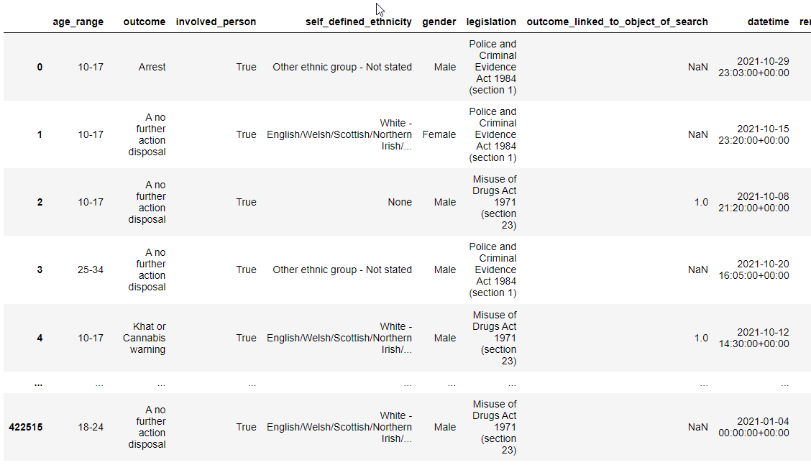

---

### Understanding the dataset

To have a look how much columns and rows the dataset has, run the following commmand 

```
df.shape
```

Output: (422520, 17)

Our Dataset has 422520 rows and 17 columns

---

We then took a closer look at the dataset using df.info(). Here we could see well which columns there are in the dataset and of which data type they are. Furthermore we can get an overview how many non-null values there are per column in the dataset.

```python
# Info about the dataframe

df.info()
```

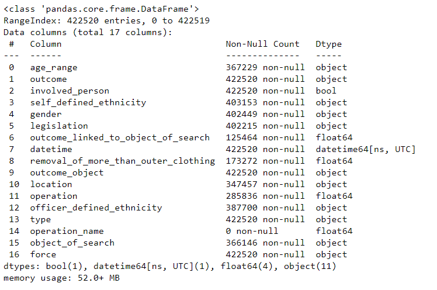

---

It't also possible to get the columns an there type with the following command 

```python
# types of the dataset

df.dtypes
```

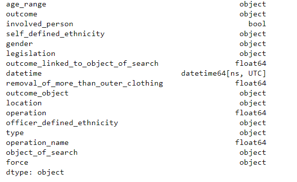

---

After that we checked if there are any null values in each column

```python
df.isnull().any()
```

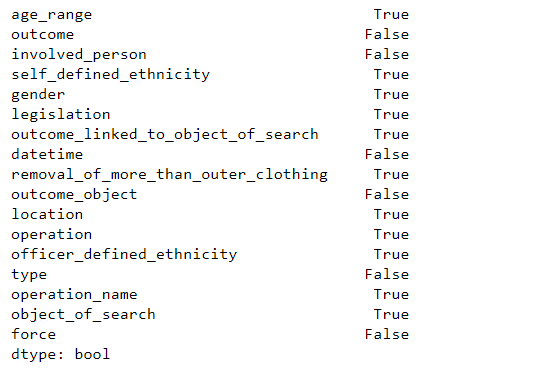

If it's True the column has null values

---

In the command above, we saw that the data set contains null values. For this reason we have examined how many values in each column are null

```python
# number of null values in each column

df.isnull().sum()
```

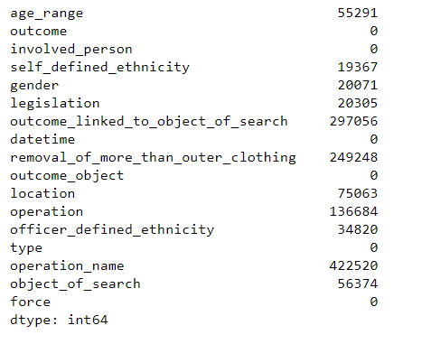

---

The data set contains a number of null values. To get a better sense of how much there is, let's check what percentage of the data has null values per column

```python
# Shows how much % of the data per column is null

df.isnull().sum() / df.shape[0]
```

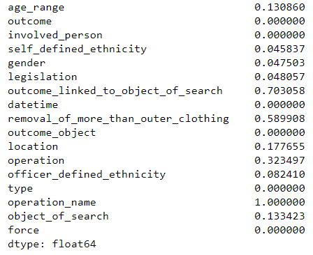

The outcome_linked_to_object_of_search has 70% null values. However, this is not further relevant, since the outcome is listed in the column outcome. Although the dataset has some null values, we still have enough after deleting the null values contained in the dataset

---

Get the Columns of the Dataset with the following comand:

```python
# columns of the dataset 

df.columns
```

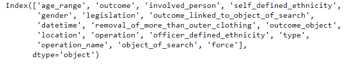

---

In the next step we check how much In the next step we look at how the gender distribution is in the data set 

```python
# distribution of gender
df['gender'].value_counts()
```

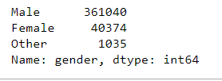

As can already be seen in the statistics, significantly more men than women have been stopped. 

---

After that we checked what the distribution of age_range is in the dataset

```python
# age range 

df['age_range'].value_counts()
```

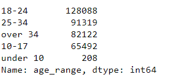

As the statistics show, most of the people stopped are between 18 and 24 years old. Only 208 people under the age of 10 were checked. Whether these are relevant for our evaluation must be checked in the next steps.

---

```python
# ethnic categories => The self-defined ethnicity of the person stopped

df['self_defined_ethnicity'].value_counts()
```

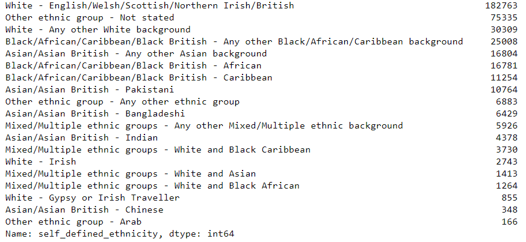

---

```python
# ethnic categories => The officer-defined ethnicity of the person stopped

df.officer_defined_ethnicity.value_counts()
```

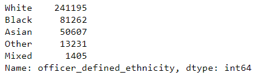

---

```python
df['outcome'].value_counts()
```

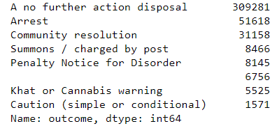

---

```python
# How much % is null => only 1,5%

df.outcome.value_counts() / df.type.notnull().sum()
```


---

```python
df['object_of_search'].value_counts()
```

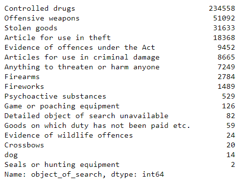

---

```python
# shows the forces in the dataframe
# force = county

df['force'].value_counts()
```

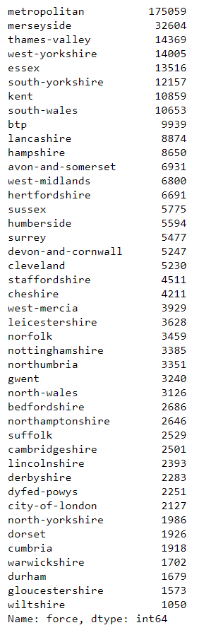

---

## Correlation

We created a correlation matrix to show correlation coefficients between variables

```python
corrMatrix = df.corr()
```

Unfortunately, no correlation could be detected in our data set 


## Cleaning of the dataset

After we have examined the dataset we will clean the dataset in the next step 

```python
# Cleanup of the DataFrame. All null values in the columns are deleted

df_cleared = df[df.age_range.notna() & df.gender.notna() & 
df.officer_defined_ethnicity.notna() & df.self_defined_ethnicity.notna()
 & df.object_of_search.notna() & df.location.notna() & 
df.legislation.notna()]
```

----------------------------------------------------------

To see if there was an action when the person stopped or not we split the 'outcome' column into:

- action = 1 => person is arrested, gets a ticket etc.

- action = 0 => nothing happens 

```python
# Split the DataFrame into noAction = 0 and Action = 1

df_noAction = df_cleared[df_cleared.outcome.isin(['A no further action disposal'])]
df_noAction.insert(loc=1, column='action', value=0)

df_Action = df_cleared[df_cleared.outcome.isin(['Arrest', 'Community resolution', 'Summons / charged by post', 'Penalty Notice for Disorder', 'Khat or Cannabis warning', 'Caution (simple or conditional)'])]
df_Action.insert(loc=1, column='action', value=1)

df_cleared = pd.concat([df_noAction, df_Action])
```

__________

We divide the individuals according to their ethnicity into:

- white

- black

- asian

- other ethnicity

- mixed ethnicity

```python
# Classify ethnic groups according to 5 groups: white, black, asian, other ethnic group, mixed/multiple ethnic groups

df_clean['self_defined_ethnicity_white'] = df_clean.self_defined_ethnicity.apply(lambda x : x == "White - English/Welsh/Scottish/Northern Irish/British" or x == 'White - Any other White background' or x == 'White - Irish' or x == 'White - Gypsy or Irish Traveller' if isinstance(x, object) else 0)

df_clean['self_defined_ethnicity_black'] = df_clean.self_defined_ethnicity.apply(lambda x : x == 'Black/African/Caribbean/Black British - Any other Black/African/Caribbean background' or x == 'Black/African/Caribbean/Black British - African' or x == 'Black/African/Caribbean/Black British - Caribbean' if isinstance(x, object) else 0)

df_clean['self_defined_ethnicity_asian'] = df_clean.self_defined_ethnicity.apply(lambda x : x == 'Asian/Asian British - Any other Asian background' or x == 'Asian/Asian British - Pakistani' or x == 'Asian/Asian British - Bangladeshi' or x == 'Asian/Asian British - Indian' or x == 'Asian/Asian British - Chinese' if isinstance(x, object) else 0)

df_clean['self_defined_ethnicity_other'] = df_clean.self_defined_ethnicity.apply(lambda x : x == 'Other ethnic group - Not stated' or x == 'Other ethnic group - Any other ethnic group' or x == 'Other ethnic group - Arab' if isinstance(x, object) else 0)

df_clean['self_defined_ethnicity_mixed'] = df_clean.self_defined_ethnicity.apply(lambda x : x == 'Mixed/Multiple ethnic groups - Any other Mixed/Multiple ethnic background' or x == 'Mixed/Multiple ethnic groups - White and Black Caribbean' or x == 'Mixed/Multiple ethnic groups - White and Asian' or x == 'Mixed/Multiple ethnic groups - White and Black African' if isinstance(x, object) else 0)

```

__________________

After that we changed the type of the colums

```python
# change type of columns 

df_clean.involved_person = df_clean.involved_person.astype(int)
df_clean.self_defined_ethnicity_white   = df_clean.self_defined_ethnicity_white.astype(int)
df_clean.self_defined_ethnicity_black   = df_clean.self_defined_ethnicity_black.astype(int)
df_clean.self_defined_ethnicity_asian   = df_clean.self_defined_ethnicity_asian.astype(int)
df_clean.self_defined_ethnicity_other   = df_clean.self_defined_ethnicity_other.astype(int)
df_clean.self_defined_ethnicity_mixed   = df_clean.self_defined_ethnicity_mixed.astype(int)

df_clean = df_clean.drop('self_defined_ethnicity', axis=1)
```

____

Now we can delete alls not needed columns 

```python
# delete columns not needed

df_clean = df_cleared.drop(['outcome','outcome_linked_to_object_of_search', 'datetime', 'removal_of_more_than_outer_clothing', 'outcome_object', 'location'], axis=1)
```

_____

In order to process the data in a model, the data must be encoded. For this we use the following methods: 

- pd.get_dummies
  - With this method all feature keys are encoded 
- LabelEncoder  
  - With this method the label key is encoded 


```python
df_dummies = pd.get_dummies(df_clean, columns=['gender', 'legislation', 'officer_defined_ethnicity', 'type', 'object_of_search', 'force' ])

```


```python
from sklearn.preprocessing import LabelEncoder

labelEncoder = LabelEncoder()

labelEncoder.fit(['10-17', '25-34', 'over 34', '18-24', 'under 10'])
df_encoded = df_dummies
df_encoded.age_range = labelEncoder.fit_transform(df_dummies.age_range)
```
